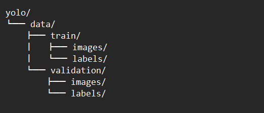
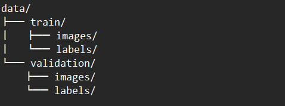
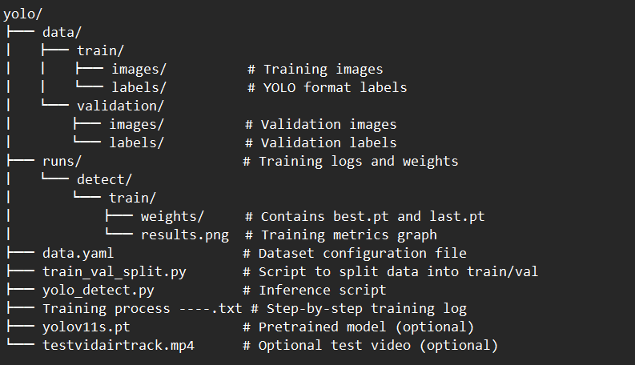

README.md

YOLO11 Object Detection – Custom Model Training

This repository contains a complete training and inference pipeline for a custom object detection model using [Ultralytics YOLO](https://github.com/ultralytics/ultralytics), trained on a labeled dataset in YOLO format.

Training process :

In Whatever terminal we are using. Here , Anaconda Environment I used -- Cause we are dealing with python

>>   conda create --name yolo11-env python=3.12 -y

What it does:
Creates a new virtual environment named yolo11-env using Python 3.12.

Why it's done:

Isolation: Keeps your YOLO project and all its dependencies separate from your system Python and other projects.
Ensures reproducibility: You can recreate the same environment anywhere using the same Python version and dependencies.

>>   conda activate yolo11-env

What it does:
Activates the yolo11-env environment, allowing you to install packages and run code within it.

Why it's done:
You need to activate the environment before installing libraries or running code inside it.

>>   pip install ultralytics

Basically , Installs the Ultralytics YOLOv5/v8 library...

>>   pip install --upgrade torch torchvision torchaudio --index-url https://download.pytorch.org/whl/cu124

What it does:

Upgrades to the GPU version of PyTorch that supports CUDA 12.4 (for NVIDIA GPUs).
Also installs related libraries: torchvision (for image tasks) and torchaudio.

Why it's done:

The default Ultralytics install uses CPU-only PyTorch, which is much slower for training.
This command installs GPU-accelerated PyTorch, so training and inference are way faster.
CUDA, cuDNN, etc., are included in the package — no need to manually download drivers or toolkits.

>>   python -c "import torch; print(torch.cuda.get_device_name(0))"

Returns us the GPU version if all the before things are done perfectly until now.

DATASET ARRANGEMENT :

DATASET __ First Took the dataset in Images and lables folders.

There is other way of getting images and then using Lable studio or something to draw boxes on each image and then preparing the dataset... Else form Online...

Next getting them in this format :

To achieve this tho :

Open Command Prompt and run the following commands to set up your workspace:

>>   mkdir %USERPROFILE%\Documents\yolo
>>   cd %USERPROFILE%\Documents\yolo
>>   mkdir data

use the script train_val_split.py to automatically:
Detect all image-label pairs
Shuffle them randomly
Split them into training (e.g., 80%) and validation (e.g., 20%) sets
Organize them into folders correctly

========>   Run this in your command prompt (inside the yolo/ folder):
            
Your folder should contain:

IMG_3387.JPG, IMG_3387.txt, etc.

All image files and their matching label files in one single folder.Your folder should contain:

IMG_3387.JPG, IMG_3387.txt, etc.

All image files and their matching label files in one single folder.

>>   curl --output train_val_split.py https://raw.githubusercontent.com/EdjeElectronics/Train-and-Deploy-YOLO-Models/refs/heads/main/utils/train_val_split.py

This downloads train_val_split.py — the script that will split your dataset.

Find the full path where you currently have your images (.JPG) and labels (.txt).
            
Example > C:\Users\Jey\Documents\my_dataset

Your folder should contain:
IMG_3387.JPG, IMG_3387.txt, etc.
All image files and their matching label files in one single folder.

Now run the script like this:

>>   python train_val_split.py --datapath="C:\\Users\\Jey\\Documents\\my_dataset" --train_pct=.8

Important:
Use double backslashes \\ in Windows paths.
This means 80% images will go to training, 20% to validation.

Finally after everything :

Inside your yolo/data/ folder, you will see:

After all this... 

create the Ultralytics training configuration YAML file
This file specifies the location of your train and validation data, and it also defines the model’s classes

To create the configuration file, open a text editor such as Notepad and copy + paste the following text into it.

>> -------------------------------------------------------------

path: C:\Users\<username>\Documents\yolo\data
train: train\images
val: validation\images

nc: 5

names: ["class1", "class2", "class3", "class4", "class5"]

>> --------------------------------------------------------------
Make the following changes:

<your_username> → replace with your Windows username (e.g., Evan, Jey, etc.).
nc: → set the number of classes (e.g., 4 if you have 4 object types).
names: → replace with the actual class names in the same order as in your labels.

Save the file as “data.yaml” in the “yolo” folder.

Ensure your folder yolo contains:

data/ → with train/ and validation/ subfolders, each having images/ and labels/.
data.yaml → the file you just created.
train_val_split.py → optional script used earlier for splitting the dataset.

NEXT TRAINING ... 

Our Anaconda terminal is already is in yolo folder i guess ... if not run this :

>>   cd C:\Users\Jey\Documents\yolo

Then to start training :

>>   yolo detect train data=data.yaml model=yolo11s.pt epochs=60 imgsz=640

* Make chages as yuo want

After Training Finishes:

Look in : C:\Users\Jey\Documents\yolo\runs\detect\train\weights
You should find :

best.pt → best performing model (✅ use this for testing/inference)
last.pt → model from the final epoch

Also check:

results.png for training graphs
opt.yaml and train_batch*.jpg for diagnostics

RUNNING the model :

Run this command after the training :

>>   curl -o yolo_detect.py https://raw.githubusercontent.com/EdjeElectronics/Train-and-Deploy-YOLO-Models/refs/heads/main/yolo_detect.py

The script takes two arguments, “model” and “source”:

–model : Path to the trained model weights (e.g. “runs/detect/train/weights/best.pt”)
–source: Path to a image file (“test_img.jpg”), a folder of images (“img_dir”), a video file (“test_vid.mp4”), or the index for a connected USB camera (“usb0”).

After everything is done the folder looks like this.

And then final command to run :

>>   python yolo_detect.py --model=runs/detect/train/weights/best.pt --source=usb0  # Run on USB webcam (If your webcam is not usb0, try 0, 1, or check your OS's device list.)

>>   python yolo_detect.py --model=runs/detect/train/weights/best.pt --source=testvidairtrack.mp4  # Run on vid.mp4 video file.

## ⚠️ Notes

* All data and code is formatted to match Ultralytics YOLOv8/YOLO11 standards
* You can replace the model with `yolov8s.pt`, `yolov5s.pt`, etc., and re-train.

---

## 📎 Credits

* Ultralytics (YOLO): [https://github.com/ultralytics/ultralytics](https://github.com/ultralytics/ultralytics)

---

## 🧠 License

This project is open-source for educational use. Please cite or link if you build from this.

